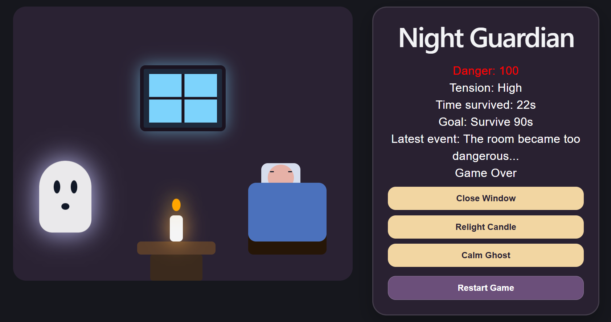

# Night Guardian

Night Guardian is a cozy-spooky browser game prototype built with React.

## Current Prototype



The player protects a sleeping person through the night by managing small threats inside the room:

* a window that may open on its own
* a candle that may go out
* a ghostly presence that may appear

If danger gets too high, the game is lost. If the player survives until the survival time limit, the game is won.

---

## Current Version

This repository currently contains a playable room-based prototype.

The current version includes:

* a structured room layout built with React components
* interactive room events and state-based gameplay
* animated ghost, candle, and environmental effects
* conditional UI and tension-based visual feedback
* iterative UI and gameplay experimentation

The project is being developed incrementally, with gameplay systems and atmosphere evolving over time.

---

## Features Implemented

* Room-based game layout
* Random window event
* Random candle event
* Random ghost event
* Danger system
* Win condition (survive until morning)
* Lose condition (danger reaches maximum)
* Restart system
* Animated candle flicker
* Animated ghost bobbing
* Animated window opening
* Tension-based visual changes
* Interactive control panel
* Basic visual storytelling and scene composition
* Cozy-spooky room scene composition
* Stylized sleeping character and bed setup
* Candle and table environment setup
* Interactive control panel

---

## Tech Stack

* React
* JavaScript
* CSS animations
* Vite

---

## Why I Built This

I wanted to build an interactive game project from scratch and use it to strengthen my frontend development skills, especially:

* React state and effects
* time-based logic
* event-driven UI
* debugging and iteration

---

## Development Approach

This project is being built iteratively, with each version focusing on improving both gameplay structure and atmosphere.

Current development focuses include:

* refining room composition and visual storytelling
* improving interaction feedback and animations
* experimenting with gameplay balance and pacing
* gradually introducing more complex systems over time

The project intentionally reflects an incremental learning and problem-solving process, with features evolving through experimentation and iteration.

---

## Current Status

Playable room-based prototype complete.

Core gameplay systems, scene layout, and interactive elements are functional.

Additional gameplay systems, UI polish, balancing, and atmospheric improvements are planned for future versions.

---

## Run Locally

```bash
npm install
npm run dev
```

---

# Planned Improvements

* improved event narration system
* additional gameplay mechanics and balancing
* more atmospheric animations and interactions
* improved mobile-friendly controls
* enhanced visual polish and transitions
* asset-based visuals and environmental details
* expanded gameplay systems and progression

---

## Author

Farana Naz Tultul
